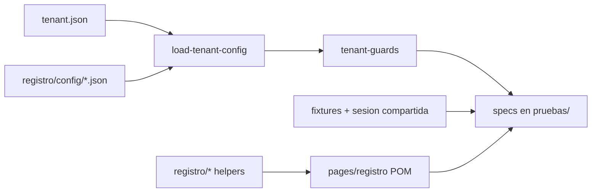

# Suite Playwright por tenant (QA + bypass)

Suite de pruebas de UI contra el entorno QA de Enersinc. El login usa la cabecera `QA-Bypass-Token`. El código compartido vive en `tests/support/`; los datos JSON y los specs viven en `tests/tenants/<tenant>/`.

Tenants activos: **emug**, **gecg** y **tbsg**. El tenant se elige con `TEST_TENANT` (por defecto `emug`).

## Instalar y correr

Desde la raíz de este repo:

```bash
npm install
npx playwright install
```

Correr el tenant por defecto (`emug`):

```bash
npx playwright test --project=chromium
```

Correr gecg o tbsg (PowerShell):

```powershell
$env:TEST_TENANT="gecg"
npx playwright test --project=chromium

$env:TEST_TENANT="tbsg"
npx playwright test --project=chromium
```

Proyectos:

- `chromium` / `firefox` / `webkit`: specs autenticados (Registro). Un login por worker; la sesión se reutiliza.
- `chromium-unauth` (y equivalentes): specs de auth en `tenants/<tenant>/auth/pruebas/`. Cada test arranca sin sesión.

Scripts de `package.json`:

- `npm test` — suite según `playwright.config.ts`.
- `npm run test:chromium` — solo Chromium autenticado.
- `npm run refresh:dropdowns` — recaptura opciones de combobox desde QA (no forma parte de la suite de tenant).

## Variables de entorno

Definir estas claves en `.env` (no se versiona):

- `BASE_URL` — URL de QA (`use.baseURL`).
- `TOKEN_BYPASS` — valor de la cabecera `QA-Bypass-Token`.
- `TEST_TENANT` — `emug`, `gecg` o `tbsg`. Filtra `tests/tenants/<tenant>/**/*.spec.ts`.
- `VALID_EMAIL` / `VALID_PASSWORD` — login válido.
- `INVALID_EMAIL` / `INVALID_PASSWORD` — casos negativos de auth.

Si `VALID_PASSWORD` contiene apóstrofos, usar comillas dobles (`VALID_PASSWORD="..."`). Las comillas simples de dotenv cortan el valor.

## Arquitectura

```text
tests/
├── global-setup.ts                   # valida TEST_TENANT, carpeta y tenant.json
├── support/                          # código compartido
│   ├── env.ts, urls.ts, timeouts.ts
│   ├── ui-login.ts, shared-session.ts, fixtures.ts
│   ├── ant-select-collect-options.ts
│   ├── config/                       # loader, registry, guards, types/
│   ├── pages/                        # POM de login
│   │   └── registro/                 # POM por módulo de Registro
│   └── registro/                     # helpers de DOM (labels, tabs, columnas)
└── tenants/
    ├── emug/
    │   ├── tenant.json               # módulos enabled/disabled
    │   ├── auth/pruebas/
    │   └── registro/
    │       ├── config/               # JSON de columnas, tabs, wizard
    │       └── pruebas/              # specs Playwright
    ├── gecg/                         # misma forma
    └── tbsg/                         # misma forma; incluye insumos-oferta y otros-contratos
```



Un módulo de producto nuevo (por ejemplo MDM) suma `support/pages/mdm/` y `tenants/<tenant>/mdm/{config,pruebas}/`.

## Helpers y POM

### Login y sesión

- `ui-login.ts` — recorre correo + contraseña hasta el tablero autenticado.
- `shared-session.ts` — un contexto autenticado por worker en proyectos que no terminan en `-unauth`.
- `fixtures.ts` — exporta `test` / `expect`. Los specs autenticados deben importar desde aquí (no desde `@playwright/test`) para recibir `dashboardPage`.
- `EmailStepPage` / `PasswordStepPage` / `DashboardPage` — POM del flujo de entrada.

### Config y guards

- `module-registry.ts` — `MODULE_IDS` y rutas a `registro/config/*.json`.
- `load-tenant-config.ts` — `getTenantManifest`, `isModuleEnabled`, `isTabEnabled`, getters `getRegistro*Config`. Carga perezosa: un JSON de módulo deshabilitado no se lee.
- `tenant-guards.ts` — `skipUnlessModuleEnabled`, `skipUnlessTabEnabled`, `skipUnlessAnyTabEnabled`, `skipUnlessAllTabsEnabled`, `whenTabEnabled`.

Los submódulos de Registro también exigen `modules.registro.enabled` en `tenant.json`. Si un módulo tiene `full: true`, se usan todas las pestañas del JSON (no solo `*EnabledTabNames`).

### Helpers de DOM (`tests/support/registro/`)

- `sidebar-labels.ts` — compara etiquetas del menú lateral con el JSON.
- `tab-strip.ts` — compara la tira de pestañas (habilitadas vs bloqueadas por ACL).
- `form-field-labels.ts` — compara labels de formularios/asistentes.
- `table-column-headers.ts` — compara encabezados de grilla.
- `ant-select-collect-options.ts` — recolecta opciones de un `Select` de Ant Design (incluye listas virtuales).

### POM de Registro

`RegistroNavigationBasePage` cubre menú lateral, hover del tablero, toolbar, asistentes y aserciones compartidas. Cada módulo tiene su página (`cttos-energia.ts`, `empresas.ts`, `historial.ts`, `rpm.ts`, `sireci.ts`, `planta-consumos.ts`, …) que lee el JSON del tenant activo al importar.

## Configs JSON

Cada módulo tiene un JSON en `tests/tenants/<tenant>/registro/config/`. Convención de claves:

- `*TabNames` — pestañas o vistas declaradas.
- `*EnabledTabNames` — alcanzables con las credenciales actuales.
- `*LockedTabNames` — visibles pero deshabilitadas (ACL).
- columnas de grilla, pasos y campos de asistente, mapas `*DropdownOptions`.
- `*TabSlugs` y `*TabBreadcrumbs` — aserciones de URL y miga de pan.

`navigation.json` lista el submenú de Registro: habilitados, bloqueados, legacy, previsualización del tablero y anclas de hover (`registroNavigationEmpresasHover*`, `registroNavigationLowerHover*`).

`tenant.json` es el interruptor de módulos. Un módulo `enabled: false` hace que los specs llamen `test.skip` vía guards. El loader no exige que el JSON exista si el módulo está apagado.

## Patrones de prueba

Los nombres de archivo se mantienen en inglés corto. Los títulos del reporte van en español:

- `seed-*.spec.ts` — **Semilla**: abre el módulo por el menú lateral y valida el shell del gestor.
- `path-a-*.spec.ts` — **Ruta A**: navegación por el menú lateral.
- `path-b-*.spec.ts` — **Ruta B**: hover de la tarjeta Registro en el tablero.
- `layout-*.spec.ts` — grilla, toolbar, columnas y diálogos de una vista.
- `tab-navigation.spec.ts` — cruce entre pestañas habilitadas.
- `ratify-*.spec.ts` — confirma etiquetas o renombres frente al JSON.

Auth (proyecto `*-unauth`):

- `email-auth/` — autorización por correo (válido / no registrado).
- `password-auth/` — contraseña válida, vacía, inválida o solo espacios.

Los specs autenticados usan `skipUnlessModuleEnabled` / `skipUnlessTabEnabled` en `beforeEach`.

## Tenants

### emug (~50 specs)

Habilitados: navigation, empresas, cttos-energía, otros-contratos, insumos-oferta, otros-documentos, historial.

Deshabilitados: cttos-combustible, RPM, SIRECI.

No hay módulo `planta-consumos`. La etiqueta legacy «Planta y consumos» queda en `navigation.json` para aserciones de menú.

### gecg (~50 specs)

Habilitados: navigation, empresas, cttos-energía, cttos-combustible, otros-contratos, RPM, SIRECI, historial.

Deshabilitados: planta/consumos y otros-documentos (sin carpeta de pruebas).

### tbsg

Habilitados: navigation, empresas, cttos-energía, cttos-combustible, otros contratos, insumos oferta, historial.

Deshabilitados (sin carpeta de pruebas; el bloqueo lo cubre navegación): RPM, SIRECI, otros documentos, planta y consumos.

Insumos oferta reemplaza Planta y consumos. Heat Rate ya no está; AGR queda bloqueada. Otras pestañas (Regas, Promigas, OEF, Conceptos) siguen habilitadas.

## Recaptura de desplegables

Mantenimiento aparte de la suite de tenant. Recorre los asistentes habilitados y compara (o escribe) los mapas `*DropdownOptions` del JSON.

```bash
npm run refresh:dropdowns
```

- Sin `REFRESH_DROPDOWNS_WRITE`: solo imprime diffs.
- `REFRESH_DROPDOWNS_WRITE=1`: persiste cambios en el JSON del tenant activo.
- `REFRESH_DROPDOWNS_MODULE=<moduleId>`: filtra un módulo (`registroCttosEnergia`, `registroEmpresas`, …).

Config: `playwright.refresh.config.ts`. Runner: `scripts/refresh-dropdown-options.spec.ts`.

## Convenciones de documentación

Markdown, JSDoc y comentarios van en español. No se traducen nombres de código (símbolos, claves JSON, APIs de Playwright, variables de entorno, rutas, copy de la UI, `MODULE_IDS`). Cada función en `tests/support/`, `scripts/` y `tests/global-setup.ts` lleva docstring.

Para buscar prosa en inglés residual desde la raíz del repo:

```bash
rg -n -g '*.ts' -g '*.md' '// .*\b(the|currently|instead of|is selected)\b'
rg -n -g '*.ts' '\*\s+(The|Returns the|Whether)'
```

## Fuera de alcance

- Módulo Despacho.
- Reporters CSV y harvest histórico.
- Agentes de Cursor (`.cursor/commands/*.agent.md`): definiciones de Playwright MCP, en inglés a propósito.
